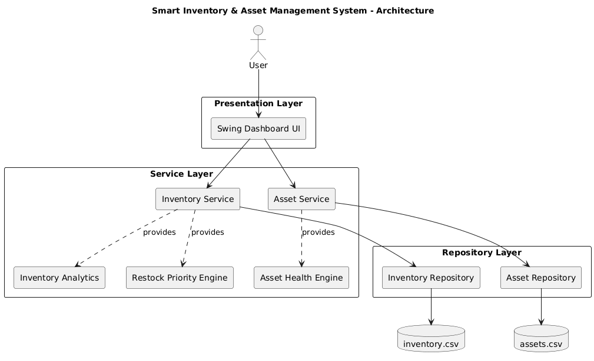
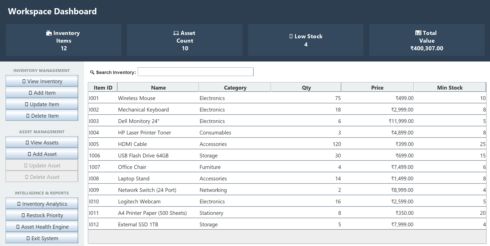
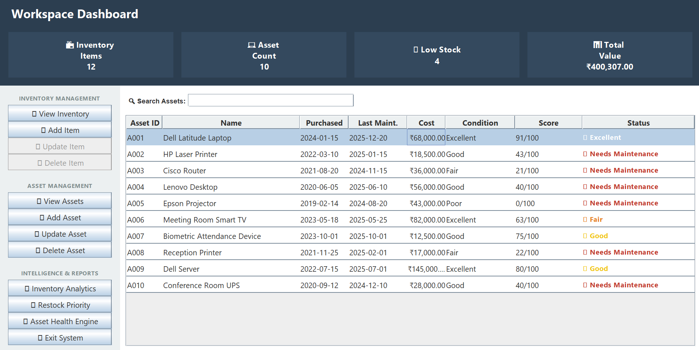
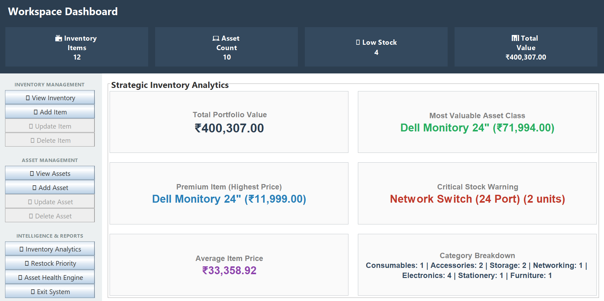
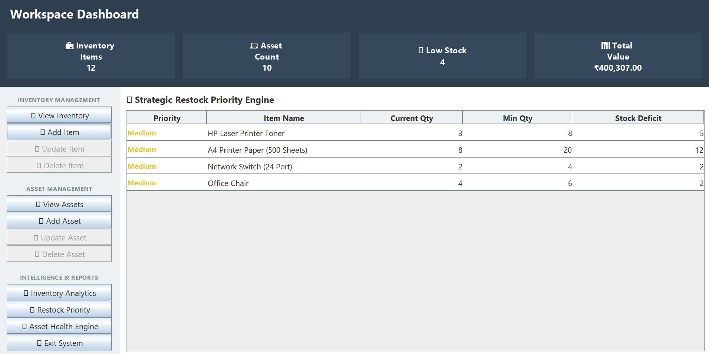
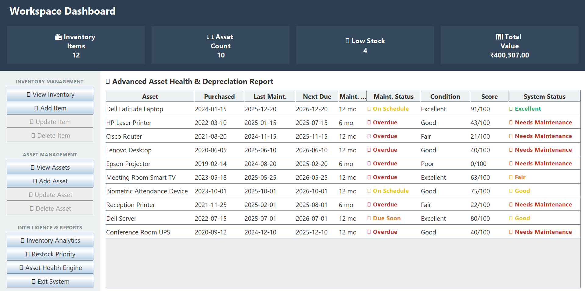
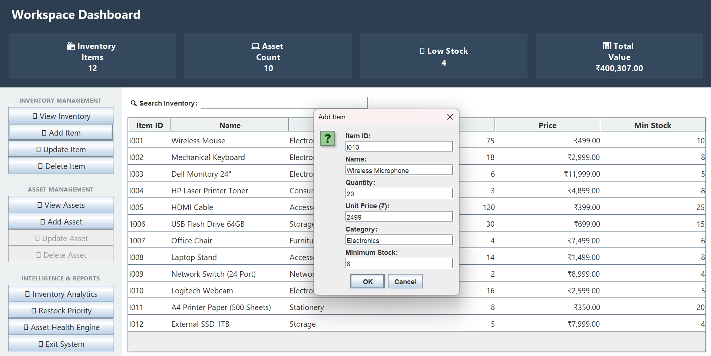
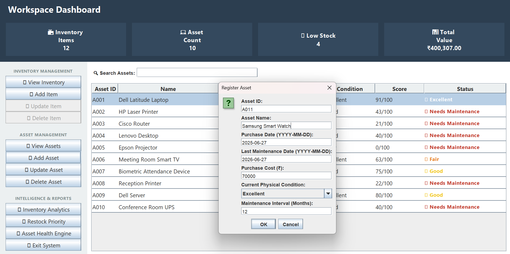
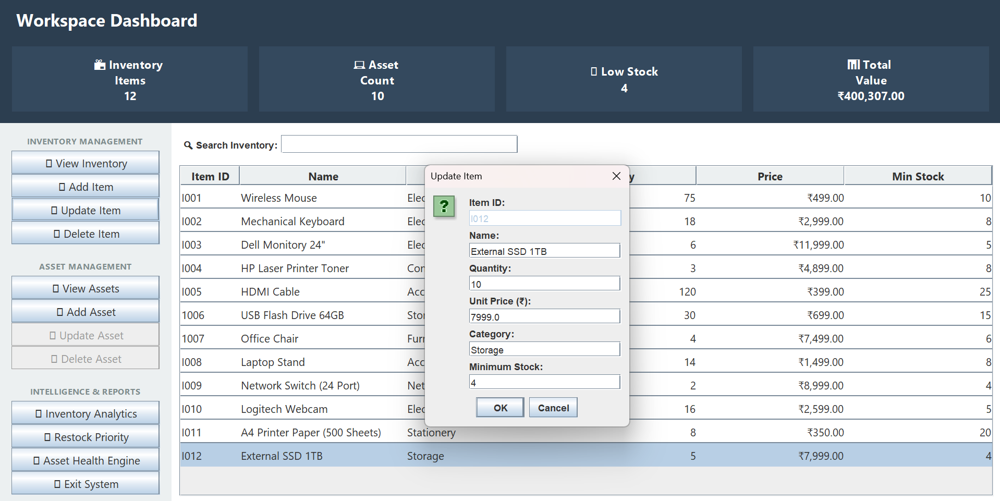
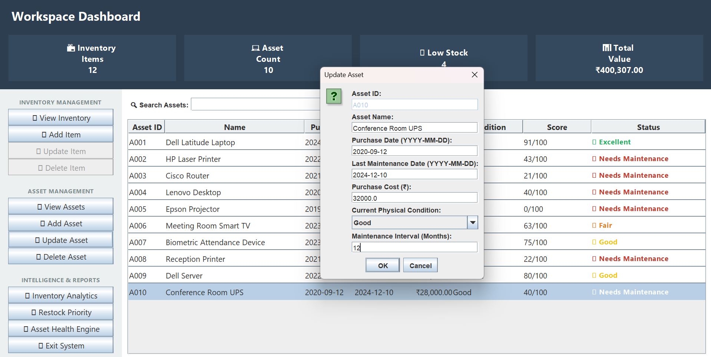

# Smart Inventory & Asset Management System

> **Enterprise-style Java Swing desktop application for Inventory and Asset Management featuring layered architecture, CSV persistence, inventory analytics, restock prioritization, asset health evaluation, and preventive maintenance scheduling.**

---

## Overview

The **Smart Inventory & Asset Management System** is a desktop application developed using **Java** and **Swing** to simplify inventory and organizational asset management through an intuitive graphical interface and intelligent business logic.

Unlike traditional CRUD-based inventory systems, this project combines inventory operations with analytical capabilities that assist users in making better operational decisions. The application manages inventory items, organizational assets, maintenance schedules, and automatically generates inventory insights and asset health reports.

The application follows a clean **Presentation → Service → Repository** layered architecture, ensuring proper separation of concerns, maintainability, and scalability. Persistent storage is implemented using CSV files, allowing the system to remain lightweight without requiring an external database.

---

# Features

## Inventory Management

* Add new inventory items
* Update existing inventory details
* Delete inventory records
* Search inventory by Item ID or Name
* Automatic CSV persistence
* Minimum stock tracking
* Real-time JTable refresh after CRUD operations

---

## Asset Management

* Register organizational assets
* Update existing asset information
* Delete assets
* Search assets by ID or Name
* Purchase date tracking
* Last maintenance date tracking
* Automatic next maintenance date calculation
* Preventive maintenance scheduling

---

## Strategic Inventory Analytics

The system automatically generates business insights including:

* Total Inventory Value
* Average Inventory Price
* Average Inventory Quantity
* Most Valuable Inventory Item
* Critical Stock Warning
* Category-wise Inventory Distribution

---

## Restock Priority Engine

The application continuously monitors inventory levels and automatically identifies items requiring replenishment.

Features include:

* Low Stock Detection
* Required Quantity Calculation
* Restock Deficit
* Priority Classification

---

## Asset Health Engine

The Asset Health Engine evaluates every organizational asset using multiple business factors instead of relying solely on physical condition.

Health evaluation considers:

* Current Physical Condition
* Asset Age
* Last Maintenance Date
* Maintenance Interval
* Maintenance Compliance

The system automatically generates:

* Health Score
* System Status
* Maintenance Status
* Next Maintenance Due Date

---

# Technology Stack

| Technology                  | Purpose                      |
| --------------------------- | ---------------------------- |
| Java                        | Core Application Development |
| Java Swing                  | Desktop User Interface       |
| Object-Oriented Programming | Software Design              |
| Collections Framework       | Data Management              |
| File Handling               | CSV Persistence              |
| Repository Pattern          | Data Access Layer            |
| Layered Architecture        | Separation of Concerns       |
| Git & GitHub                | Version Control              |

---

# Architecture

The application follows a layered architecture consisting of Presentation, Service, and Repository layers.



### Layer Responsibilities

### Presentation Layer

* Java Swing Desktop Interface
* Dashboard Navigation
* JTable Display
* User Interaction
* Dialog Management

### Service Layer

Contains the complete business logic including:

* Inventory Management
* Asset Management
* Inventory Analytics
* Restock Priority Engine
* Asset Health Engine

### Repository Layer

Responsible for data persistence.

Functions include:

* Reading CSV files
* Writing CSV files
* Loading records
* Saving records
* Repository CRUD operations

---

# Project Structure

```text
SmartInventoryAssetManagementSystem
│
├── src
│   └── com.inventory
│       ├── model
│       │   ├── Item.java
│       │   └── Asset.java
│       │
│       ├── repository
│       │   ├── InventoryRepository.java
│       │   └── AssetRepository.java
│       │
│       ├── service
│       │   ├── InventoryService.java
│       │   └── AssetService.java
│       │
│       ├── ui
│       │   └── DashboardUI.java
│       │
│       └── Main.java
│
├── data
│   ├── inventory.csv
│   └── assets.csv
│
├── screenshots
│   ├── architecture-diagram.png
│   ├── inventory-management.png
│   ├── asset-management.png
│   ├── inventory-analytics.png
│   ├── restock-priority.png
│   ├── asset-health-engine.png
│   ├── add-item-dialog.png
│   ├── add-asset-dialog.png
│   ├── update-item-dialog.png
│   └── update-asset-dialog.png
│
├── README.md
└── .gitignore
```

---

# Application Screenshots

## Inventory Management



The Inventory Management module provides complete CRUD functionality for inventory items. Users can add, update, delete, search, and monitor inventory while dashboard statistics refresh automatically.

---

## Asset Management



The Asset Management module maintains organizational assets, tracks maintenance history, calculates health scores, and schedules preventive maintenance.

---

## Strategic Inventory Analytics



The analytics dashboard summarizes inventory value, pricing trends, stock levels, and category distribution, helping users make informed inventory decisions.

---

## Restock Priority Engine



The Restock Priority Engine identifies inventory shortages, calculates required quantities, and prioritizes replenishment based on stock thresholds.

---

## Asset Health Engine



The Asset Health Engine evaluates every registered asset by combining multiple business parameters rather than relying solely on its current condition.

The evaluation considers:

* Current Physical Condition
* Asset Age
* Last Maintenance Date
* Maintenance Interval
* Maintenance Compliance

Based on these parameters, the system automatically computes:

* Next Maintenance Due Date
* Maintenance Status
* Health Score (0–100)
* Overall System Status

This enables proactive maintenance planning and provides a realistic overview of asset reliability.

---

## Add Inventory Item



The application provides a user-friendly dialog for registering inventory items. Input validation ensures that mandatory fields are completed and invalid values are rejected before saving.

---

## Register Asset



Assets can be registered with purchase details, maintenance schedule, and current condition. The application validates all inputs before storing the asset.

---

## Update Inventory Item



Existing inventory records can be modified using pre-filled update dialogs, reducing user effort and minimizing data entry errors.

---

## Update Asset



Asset details, including maintenance information, can be updated at any time. Health Score and Maintenance Status are automatically recalculated whenever asset information changes.

---

# Business Logic Highlights

Unlike traditional CRUD-based desktop applications, this project introduces multiple intelligent business modules.

## Inventory Analytics

Provides meaningful inventory insights including:

* Inventory valuation
* Category distribution
* Average pricing
* Average stock levels
* High-value inventory identification
* Critical stock warnings

---

## Restock Priority Engine

The system continuously compares current stock against minimum stock thresholds.

Items requiring replenishment are automatically identified and categorized based on stock deficit, allowing users to prioritize procurement activities.

---

## Asset Health Evaluation

The application evaluates asset health using a combination of:

* Physical condition
* Asset age
* Maintenance compliance

The calculated Health Score is then mapped to an overall system status such as:

* Excellent
* Good
* Fair
* Needs Maintenance
* Critical

This provides a more realistic assessment than relying only on physical condition.

---

## Preventive Maintenance Scheduling

Instead of estimating maintenance from purchase date alone, the system tracks:

* Last Maintenance Date
* Maintenance Interval

The application automatically calculates:

* Next Maintenance Due Date
* Current Maintenance Status

This enables proactive maintenance planning and better asset lifecycle management.

---

# How to Run

## Prerequisites

* Java JDK 17 or later
* IntelliJ IDEA (recommended)

---

## Clone Repository

```bash
git clone https://github.com/AdityaPansare1408/smart-inventory-asset-management-system.git
```

---

## Open Project

Open the project in IDE.

Ensure the `data` folder is present in the project root so that inventory and asset data can be loaded correctly.

---

## Run the Application

Run `Main.java` from your IDE.

The application launches directly into the Inventory Management dashboard.

---

## Usage

1. Add inventory items from **Inventory Management**.
2. Register organizational assets from **Asset Management**.
3. View inventory insights in **Inventory Analytics**.
4. Monitor low-stock items using the **Restock Priority Engine**.
5. Track maintenance schedules and health scores using the **Asset Health Engine**.

---

# Future Enhancements

- JDBC Integration
- MySQL Database
- DAO Pattern
- Transaction Management
- Advanced Search & Filtering
- Spring Boot REST API
- Role-Based Authentication
- JWT Authentication
- Report Export (PDF / Excel)
- Email Notifications
- Docker Deployment

---

# Learning Outcomes

This project demonstrates practical implementation of:

* Object-Oriented Programming (OOP)
* Layered Software Architecture
* Repository Pattern
* Java Swing GUI Development
* Collections Framework
* File Handling
* CSV Persistence
* Business Logic Design
* Data Validation
* Preventive Maintenance Scheduling
* Git & GitHub Version Control

---

# Author

**Aditya Pansare**

M.Tech in Computer Engineering

GitHub:
https://github.com/AdityaPansare1408

---

## License

This project is licensed under the MIT License.

See the LICENSE file for more details.

